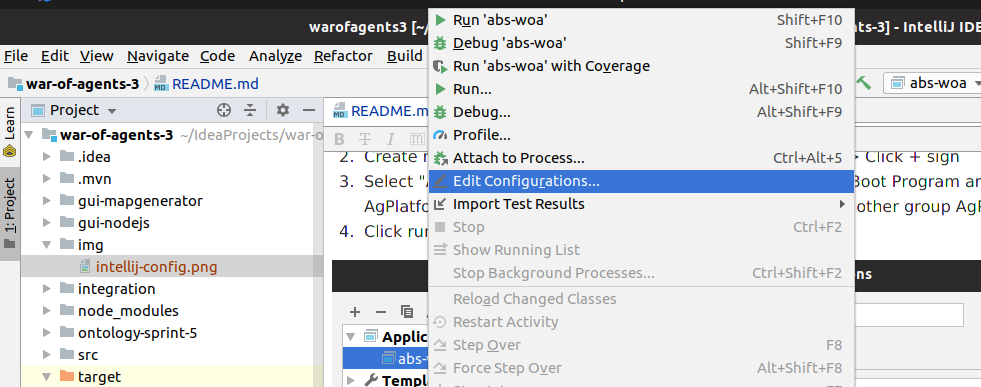
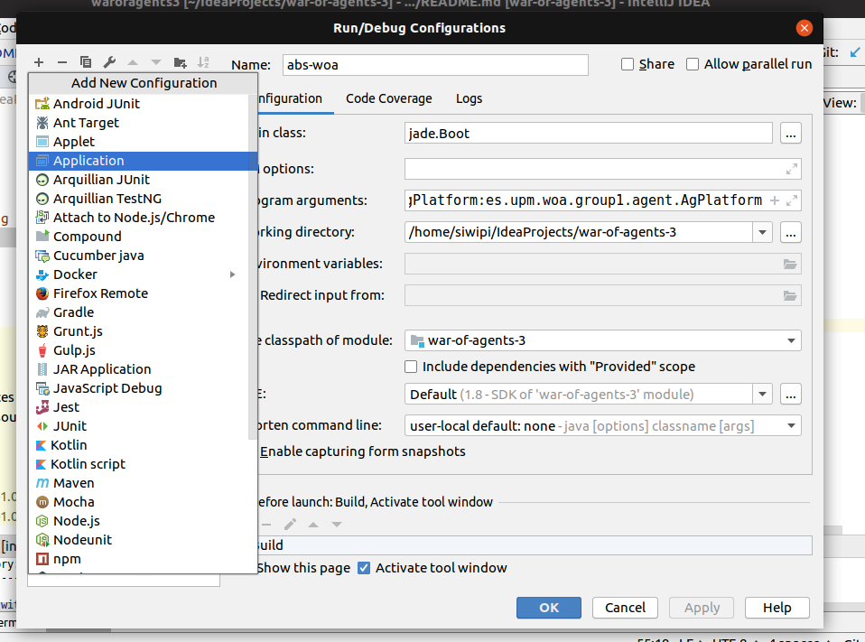
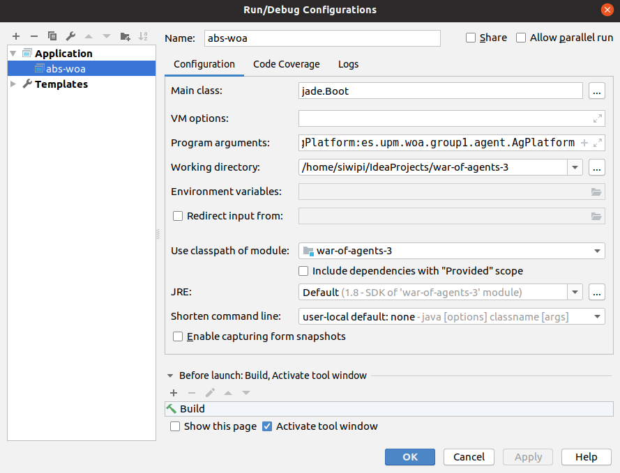

# war-of-agents-3

This repository contains project for "Agent Based Software Development" class realized at Universidad Politécnica de Madrid (UPM) in summer 2019

## Runing program
Clone repository:
``` 
git clone https://github.com/piotrsiwinski/war-of-agents-3.git
```

To build world-of-agents jar (from root of project):

! For windows use mvnw.cmd script
``` 
./mvnw clean package -DskipTests
```

To run application and start AgPlatform at startup:
```
java -jar target/war-of-agents-3-1.0-SNAPSHOT-jar-with-dependencies.jar -gui platform:es.upm.woa.group3.agent.AgPlatform
```

## Running NodeJS GUI

Go to gui-nodejs directory
```
cd gui-nodejs/
```

Install node dependencies:
```
npm install
```

Run application:

```
npm run start
```

## Running on windows
! For windows use .\mvnw.cmd script instead of mvnw


## Running with other groups
It is recommended to run in in IDE like IntelliJ.
For that in IntelliJ:
1. Open this project in IntelliJ (File -> Open) or use import project option and point to pom.xml file
2. Create new start Configuration: Run -> Edit Configurations -> Click + sign
3. Select "Application" and and fill properties:

```
Main Class: jade.Boot
Program arguments: -gui AgPlatform:es.upm.woa.groupX.agent.AgPlatform 
```

Instead of X type other's group AgPlatform, for example:  group3

4. Click run

In case of problems check img catalog to /img (from root folder) screenshots of running application:




##Troubleshooting

In case of problems try:
```
./mvnw clean

```